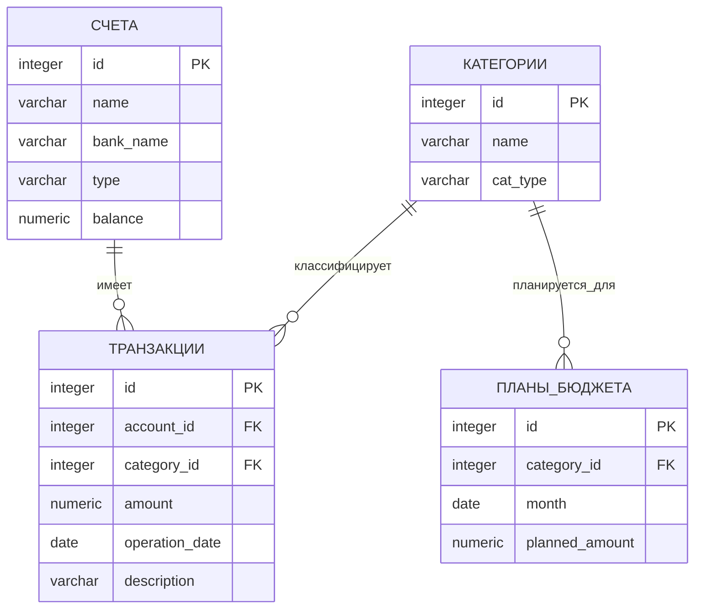

# bd
# Лабораторные работы по Базам Данных  
**Булгаков Андрей 02261-ДБ**  
**Вариант 63. Учет домашних финансов**
## 1. Постановка задачи
### Бизнес-цель
Разработать информационную систему для учета личных финансов, контроля доходов/расходов, управления счетами и планирования бюджета.

### Требования к системе
1. **Учет банковских счетов**: дебетовые, кредитные карты, наличные
2. **Категоризация операций**: разделение на доходы и расходы  
3. **Регистрация транзакций**: все финансовые операции с привязкой к счетам и категориям
4. **Планирование бюджета**: установка месячных лимитов по категориям расходов
5. **Контроль и отчетность**: мониторинг исполнения бюджета и анализ динамики баланса

### Ограничения
- Одна транзакция относится ровно к одному счету и одной категории
- План бюджета составляется только для категорий расходов
- Для одной категории может быть только один план на месяц
- Сумма транзакции всегда положительная (> 0)

### Выходные документы
1. **Отчет о превышении бюджета** по категориям за текущий месяц, отсортированный по величине перерасхода
2. **Динамика остатка** на основном счете за последние 6 месяцев, отсортированная по дате

## 2. ER-диаграмма


Обозначения связей:

||--o{ — отношение "один-ко-многим" (One-to-Many)

Сущность слева имеет множество связанных записей справа

## 3. Логическая модель (сущности)

### Сущность "СЧЕТА" (accounts)

| Атрибут | Тип данных | Ограничения | Описание |
|---------|------------|-------------|----------|
| **id** | SERIAL | PRIMARY KEY | Автоинкрементный идентификатор |
| **name** | VARCHAR(100) | NOT NULL | Название счета ("Основная карта") |
| **bank_name** | VARCHAR(100) | NULL | Наименование банка |
| **type** | VARCHAR(50) | NOT NULL, CHECK | Тип: 'дебетовый','кредитный','наличные' |
| **balance** | NUMERIC(15,2) | NOT NULL, DEFAULT 0.00 | Текущий баланс |

### Сущность "КАТЕГОРИИ" (categories)

| Атрибут | Тип данных | Ограничения | Описание |
|---------|------------|-------------|----------|
| **id** | SERIAL | PRIMARY KEY | Автоинкрементный идентификатор |
| **name** | VARCHAR(100) | NOT NULL | Название категории ("Продукты") |
| **cat_type** | VARCHAR(10) | NOT NULL, CHECK | Тип: 'доход' или 'расход' |

### Сущность "ТРАНЗАКЦИИ" (transactions)

| Атрибут | Тип данных | Ограничения | Описание |
|---------|------------|-------------|----------|
| **id** | SERIAL | PRIMARY KEY | Автоинкрементный идентификатор |
| **account_id** | INTEGER | NOT NULL, FOREIGN KEY | Ссылка на accounts(id) |
| **category_id** | INTEGER | NOT NULL, FOREIGN KEY | Ссылка на categories(id) |
| **amount** | NUMERIC(15,2) | NOT NULL, CHECK > 0 | Сумма операции |
| **operation_date** | DATE | NOT NULL, DEFAULT CURRENT_DATE | Дата операции |
| **description** | TEXT | NULL | Описание операции |

### Сущность "ПЛАНЫ_БЮДЖЕТА" (budget_plans)

| Атрибут | Тип данных | Ограничения | Описание |
|---------|------------|-------------|----------|
| **id** | SERIAL | PRIMARY KEY | Автоинкрементный идентификатор |
| **category_id** | INTEGER | NOT NULL, FOREIGN KEY | Ссылка на categories(id) |
| **month** | DATE | NOT NULL | Месяц планирования (01 число) |
| **planned_amount** | NUMERIC(15,2) | NOT NULL, CHECK >= 0 | Плановая сумма |

## 4. Физическая модель (DDL для PostgreSQL)

```sql
-- Таблица СЧЕТА
CREATE TABLE accounts (
    id SERIAL PRIMARY KEY,
    name VARCHAR(100) NOT NULL,
    bank_name VARCHAR(100),
    type VARCHAR(50) NOT NULL CHECK (type IN ('дебетовый', 'кредитный', 'наличные')),
    balance NUMERIC(15,2) NOT NULL DEFAULT 0.00
);

-- Таблица КАТЕГОРИИ
CREATE TABLE categories (
    id SERIAL PRIMARY KEY,
    name VARCHAR(100) NOT NULL,
    cat_type VARCHAR(10) NOT NULL CHECK (cat_type IN ('доход', 'расход'))
);

-- Таблица ТРАНЗАКЦИИ
CREATE TABLE transactions (
    id SERIAL PRIMARY KEY,
    account_id INTEGER NOT NULL REFERENCES accounts(id) ON DELETE CASCADE,
    category_id INTEGER NOT NULL REFERENCES categories(id),
    amount NUMERIC(15,2) NOT NULL CHECK (amount > 0),
    operation_date DATE NOT NULL DEFAULT CURRENT_DATE,
    description TEXT
);

-- Таблица ПЛАНЫ_БЮДЖЕТА
CREATE TABLE budget_plans (
    id SERIAL PRIMARY KEY,
    category_id INTEGER NOT NULL REFERENCES categories(id),
    month DATE NOT NULL,
    planned_amount NUMERIC(15,2) NOT NULL CHECK (planned_amount >= 0),
    UNIQUE(category_id, month)
);
```

Описание физической модели:
1. Таблицы и их назначение:

accounts — хранит информацию о всех счетах пользователя

categories — справочник категорий для классификации операций

transactions — регистрирует все финансовые операции (ядро системы)

budget_plans — содержит плановые лимиты расходов по категориям

2. Типы данных:

SERIAL — автоинкрементный целочисленный тип для первичных ключей

INTEGER — для внешних ключей и целочисленных значений

VARCHAR(n) — для текстовых полей ограниченной длины

NUMERIC(15,2) — для точного хранения денежных сумм (15 цифр всего, 2 после запятой)

DATE — для хранения дат

TEXT — для неограниченных текстовых описаний

3. Ограничения целостности:

PRIMARY KEY — гарантирует уникальность записей в таблице

FOREIGN KEY — обеспечивает ссылочную целостность между таблицами

NOT NULL — поле обязательно для заполнения

CHECK — проверяет значения по заданному условию

UNIQUE — гарантирует уникальность комбинации полей

DEFAULT — задает значение по умолчанию при вставке новой записи

4. Индексы:

Оптимизируют выполнение частых запросов

Ускоряют поиск и сортировку

Улучшают производительность при работе с большими объемами данных

## 5. Примеры SQL-запросов для выходных документов
```sql
-- Заполнение таблицы accounts
INSERT INTO accounts (name, bank_name, type, balance) VALUES
('Основная карта', 'Тинькофф', 'дебетовый', 54000.50),
('Накопительный счет', 'Сбербанк', 'дебетовый', 150000.00),
('Наличные', NULL, 'наличные', 7500.00),
('Кредитная карта', 'Альфа-Банк', 'кредитный', -25000.00);

-- Заполнение таблицы categories
INSERT INTO categories (name, cat_type) VALUES
('Зарплата', 'доход'),
('Фриланс', 'доход'),
('Продукты', 'расход'),
('Транспорт', 'расход'),
('Коммунальные услуги', 'расход'),
('Развлечения', 'расход');

-- Заполнение таблицы transactions
INSERT INTO transactions (account_id, category_id, amount, operation_date, description) VALUES
(1, 1, 85000.00, '2024-05-05', 'Аванс за май'),
(1, 3, 3500.75, '2024-05-07', 'Покупки в магазине'),
(1, 4, 500.00, '2024-05-11', 'Такси до офиса'),
(3, 5, 4500.00, '2024-05-03', 'Квитанция за ЖКУ'),
(1, 6, 1200.00, '2024-05-10', 'Поход в кино');

-- Заполнение таблицы budget_plans
INSERT INTO budget_plans (category_id, month, planned_amount) VALUES
(3, '2024-05-01', 30000.00),
(4, '2024-05-01', 3000.00),
(5, '2024-05-01', 4500.00),
(6, '2024-05-01', 2000.00);
```

## 6. SQL-запросы для выходных документов
6.1 Выходной документ 1: Отчет о превышении бюджета за месяц

```sql
SELECT 
    cat.name AS "Категория расхода",
    COALESCE(SUM(t.amount), 0.00) AS "Фактические расходы",
    bp.planned_amount AS "Плановый бюджет",
    (COALESCE(SUM(t.amount), 0.00) - bp.planned_amount) AS "Отклонение",
    CASE 
        WHEN COALESCE(SUM(t.amount), 0.00) > bp.planned_amount 
            THEN '❌ ПЕРЕРАСХОД'
        WHEN COALESCE(SUM(t.amount), 0.00) < bp.planned_amount 
            THEN '✅ ЭКОНОМИЯ'
        ELSE '⚪ В ПЛАНЕ'
    END AS "Статус"
FROM categories cat
INNER JOIN budget_plans bp ON cat.id = bp.category_id
    AND bp.month = '2024-05-01'
LEFT JOIN transactions t ON cat.id = t.category_id
    AND DATE_TRUNC('month', t.operation_date) = '2024-05-01'
WHERE cat.cat_type = 'расход'
GROUP BY cat.id, cat.name, bp.planned_amount
ORDER BY "Отклонение" DESC;
```

6.2 Выходной документ 2: Динамика остатка на счете за 6 месяцев

```sql
WITH monthly_balance AS (
    SELECT
        DATE_TRUNC('month', operation_date) AS month_start,
        SUM(CASE 
            WHEN cat.cat_type = 'доход' THEN t.amount
            ELSE -t.amount 
        END) AS balance_change
    FROM transactions t
    INNER JOIN categories cat ON t.category_id = cat.id
    WHERE t.account_id = 1  -- Основная карта
        AND t.operation_date >= CURRENT_DATE - INTERVAL '6 months'
    GROUP BY DATE_TRUNC('month', operation_date)
)
SELECT 
    TO_CHAR(month_start, 'YYYY-MM') AS "Месяц",
    balance_change AS "Изменение баланса",
    SUM(balance_change) OVER (
        ORDER BY month_start 
        ROWS BETWEEN UNBOUNDED PRECEDING AND CURRENT ROW
    ) AS "Накопительный итог"
FROM monthly_balance
ORDER BY month_start DESC;
```
Проверка 3НФ (требование лабораторной):
accounts: bank_name → id (нет транзитивных зависимостей)

categories: cat_type → id (прямая зависимость)

transactions: все атрибуты зависят только от id

budget_plans: planned_amount → id (прямая зависимость)

## 7. Заключение
База данных для системы "Учет домашних финансов" спроектирована в соответствии с требованиями:

Соответствует бизнес-требованиям варианта №63

Содержит 4 таблицы 

Нормализована до 3НФ 

Реализует все требуемые выходные документы

Готова к развертыванию в PostgreSQL

Модель обеспечивает целостность данных, поддерживает все необходимые операции и может быть расширена для дополнительной функциональности.

