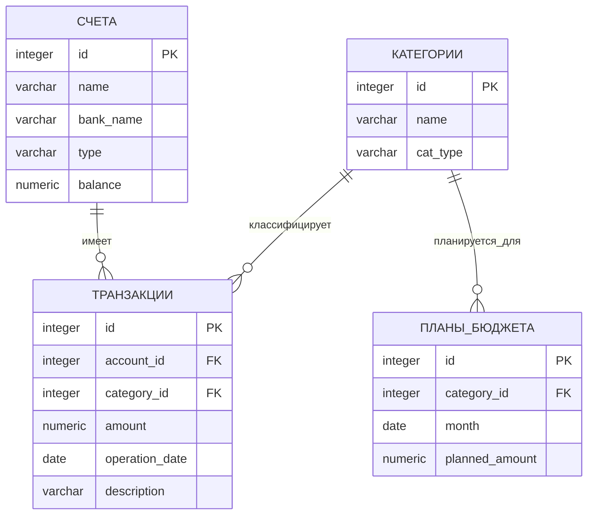

# bd
Лабораторные работы по Базам Данных
Булгаков Андрей 02261-ДБ
Вариант 63. Учет домашних финансов

## 1. Постановка задачи
Бизнес-цель
Разработать информационную систему для учета личных финансов, контроля доходов/расходов, управления счетами и планирования бюджета.

Требования к системе
Учет банковских счетов: дебетовые, кредитные карты, наличные
Категоризация операций: разделение на доходы и расходы
Регистрация транзакций: все финансовые операции с привязкой к счетам и категориям
Планирование бюджета: установка месячных лимитов по категориям расходов

Контроль и отчетность: мониторинг исполнения бюджета и анализ динамики баланса

Ограничения
Одна транзакция относится ровно к одному счету и одной категории
План бюджета составляется только для категорий расходов
Для одной категории может быть только один план на месяц
Сумма транзакции всегда положительная (> 0)

Выходные документы
Отчет о превышении бюджета по категориям за текущий месяц, отсортированный по величине перерасхода
Динамика остатка на основном счете за последние 6 месяцев, отсортированная по дате
## 2. ER-диаграмма

Обозначения связей:

||--o{ — отношение "один-ко-многим" (One-to-Many)

Сущность слева имеет множество связанных записей справа

## 3. Концептуальная модель (логическая модель)
Сущность "СЧЕТА" (Accounts)
Центральная сущность для хранения информации о финансовых инструментах пользователя.

Ключевые атрибуты:

id : integer [PK] — суррогатный первичный ключ (автоинкремент)

name : varchar(100) [NOT NULL] — понятное название счета ("Основная карта", "Накопительный")

bank_name : varchar(100) — наименование банка или места хранения

type : varchar(50) [NOT NULL] — тип счета: дебетовый, кредитный, наличные

balance : numeric(15,2) [NOT NULL] [DEFAULT 0.00] — текущий баланс

Сущность "КАТЕГОРИИ" (Categories)
Справочник категорий для классификации финансовых операций.

Ключевые атрибуты:

id : integer [PK] — суррогатный первичный ключ

name : varchar(100) [NOT NULL] — название категории ("Продукты", "Зарплата", "Транспорт")

cat_type : varchar(10) [NOT NULL] [CHECK IN ('доход', 'расход')] — тип операции

Сущность "ТРАНЗАКЦИИ" (Transactions)
Ядро системы, регистрирует все финансовые операции пользователя.

Ключевые атрибуты:

id : integer [PK] — суррогатный первичный ключ

account_id : integer [FK → СЧЕТА.id] [NOT NULL] — ссылка на счет

category_id : integer [FK → КАТЕГОРИИ.id] [NOT NULL] — ссылка на категорию

amount : numeric(15,2) [NOT NULL] [CHECK > 0] — сумма операции (всегда положительная)

operation_date : date [NOT NULL] [DEFAULT CURRENT_DATE] — дата совершения операции

description : text — необязательное описание или комментарий

Сущность "ПЛАНЫ_БЮДЖЕТА" (BudgetPlans)
Плановые показатели расходов по категориям на определенный месяц.

Ключевые атрибуты:

id : integer [PK] — суррогатный первичный ключ

category_id : integer [FK → КАТЕГОРИИ.id] [NOT NULL] — категория расхода (только для cat_type = 'расход')

month : date [NOT NULL] — месяц планирования (хранится как первое число месяца)

planned_amount : numeric(15,2) [NOT NULL] [CHECK >= 0] — плановая сумма расходов

## 4. Физическая модель (DDL для PostgreSQL)
-- Таблица СЧЕТА
CREATE TABLE accounts (
    id SERIAL PRIMARY KEY,
    name VARCHAR(100) NOT NULL,
    bank_name VARCHAR(100),
    type VARCHAR(50) NOT NULL CHECK (type IN ('дебетовый', 'кредитный', 'наличные')),
    balance NUMERIC(15,2) NOT NULL DEFAULT 0.00
);

-- Таблица КАТЕГОРИИ
CREATE TABLE categories (
    id SERIAL PRIMARY KEY,
    name VARCHAR(100) NOT NULL,
    cat_type VARCHAR(10) NOT NULL CHECK (cat_type IN ('доход', 'расход'))
);

-- Таблица ТРАНЗАКЦИИ
CREATE TABLE transactions (
    id SERIAL PRIMARY KEY,
    account_id INTEGER NOT NULL REFERENCES accounts(id) ON DELETE CASCADE,
    category_id INTEGER NOT NULL REFERENCES categories(id),
    amount NUMERIC(15,2) NOT NULL CHECK (amount > 0),
    operation_date DATE NOT NULL DEFAULT CURRENT_DATE,
    description TEXT
);

-- Таблица ПЛАНЫ_БЮДЖЕТА
CREATE TABLE budget_plans (
    id SERIAL PRIMARY KEY,
    category_id INTEGER NOT NULL REFERENCES categories(id),
    month DATE NOT NULL,
    planned_amount NUMERIC(15,2) NOT NULL CHECK (planned_amount >= 0),
    UNIQUE(category_id, month)
);
-- ============================================
-- Индексы для оптимизации производительности
-- ============================================

-- Для быстрого поиска транзакций по счету и дате
CREATE INDEX idx_transactions_account_date 
    ON transactions(account_id, operation_date DESC);

-- Для быстрого поиска транзакций по категории и дате (для отчетов)
CREATE INDEX idx_transactions_category_date 
    ON transactions(category_id, operation_date DESC);

-- Для быстрого поиска планов по месяцу
CREATE INDEX idx_budget_plans_month 
    ON budget_plans(month DESC);

-- Для проверки целостности: категория должна существовать при создании плана
CREATE INDEX idx_categories_type 
    ON categories(cat_type) 
    WHERE cat_type = 'расход';

Описание физической модели:
1. Таблицы и их назначение:

accounts — хранит информацию о всех счетах пользователя

categories — справочник категорий для классификации операций

transactions — регистрирует все финансовые операции (ядро системы)

budget_plans — содержит плановые лимиты расходов по категориям

2. Типы данных:

SERIAL — автоинкрементный целочисленный тип для первичных ключей

INTEGER — для внешних ключей и целочисленных значений

VARCHAR(n) — для текстовых полей ограниченной длины

NUMERIC(15,2) — для точного хранения денежных сумм (15 цифр всего, 2 после запятой)

DATE — для хранения дат

TEXT — для неограниченных текстовых описаний

3. Ограничения целостности:

PRIMARY KEY — гарантирует уникальность записей в таблице

FOREIGN KEY — обеспечивает ссылочную целостность между таблицами

NOT NULL — поле обязательно для заполнения

CHECK — проверяет значения по заданному условию

UNIQUE — гарантирует уникальность комбинации полей

DEFAULT — задает значение по умолчанию при вставке новой записи

4. Индексы:

Оптимизируют выполнение частых запросов

Ускоряют поиск и сортировку

Улучшают производительность при работе с большими объемами данных

## 5. Примеры SQL-запросов для выходных документов
Запрос 1: Отчет о превышении бюджета по категориям за текущий месяц

-- Выходной документ 1: Отчет о превышении бюджета
SELECT 
    cat.name AS "Категория",
    COALESCE(SUM(t.amount), 0) AS "Факт",
    bp.planned_amount AS "План",
    (COALESCE(SUM(t.amount), 0) - bp.planned_amount) AS "Отклонение"
FROM categories cat
JOIN budget_plans bp ON cat.id = bp.category_id
LEFT JOIN transactions t ON cat.id = t.category_id
WHERE cat.cat_type = 'расход'
GROUP BY cat.id, cat.name, bp.planned_amount
ORDER BY "Отклонение" DESC;

-- Выходной документ 2: Динамика остатка
SELECT 
    DATE_TRUNC('month', operation_date) AS "Месяц",
    SUM(CASE WHEN cat.cat_type = 'доход' THEN t.amount ELSE -t.amount END) AS "Изменение"
FROM transactions t
JOIN categories cat ON t.category_id = cat.id
WHERE t.account_id = 1
GROUP BY DATE_TRUNC('month', operation_date)
ORDER BY "Месяц" DESC;

## 6. -- Вставка тестовых данных (минимум 4 строки в каждой таблице)

-- 1. Заполнение таблицы счетов
INSERT INTO accounts (name, bank_name, type, balance) VALUES
('Основная карта', 'Тинькофф', 'дебетовый', 54000.50),
('Накопительный счет', 'Сбербанк', 'дебетовый', 150000.00),
('Наличные', NULL, 'наличные', 7500.00),
('Кредитная карта', 'Альфа-Банк', 'кредитный', -25000.00);

-- 2. Заполнение таблицы категорий
INSERT INTO categories (name, cat_type) VALUES
-- Доходы
('Зарплата', 'доход'),
('Фриланс', 'доход'),
('Подарок', 'доход'),
('Дивиденды', 'доход'),
-- Расходы
('Продукты', 'расход'),
('Кафе и рестораны', 'расход'),
('Транспорт', 'расход'),
('Коммунальные услуги', 'расход'),
('Развлечения', 'расход'),
('Одежда', 'расход');

-- 3. Заполнение таблицы транзакций
INSERT INTO transactions (account_id, category_id, amount, operation_date, description) VALUES
-- Доходы
(1, 1, 85000.00, '2024-05-05', 'Аванс за май'),
(1, 2, 15000.00, '2024-05-15', 'Проект для стартапа'),
-- Расходы
(1, 5, 3500.75, '2024-05-07', 'Покупки в Перекрестке'),
(1, 6, 1200.00, '2024-05-10', 'Ужин в кафе'),
(1, 7, 500.00, '2024-05-11', 'Такси до офиса'),
(3, 8, 4500.00, '2024-05-03', 'Квитанция за ЖКУ'),
(3, 9, 800.00, '2024-05-12', 'Кинотеатр'),
(4, 5, 2500.00, '2024-05-09', 'Онлайн-заказ еды');

-- 4. Заполнение планов бюджета на май 2024
INSERT INTO budget_plans (category_id, month, planned_amount) VALUES
(5, '2024-05-01', 30000.00),  -- Продукты
(6, '2024-05-01', 5000.00),   -- Кафе
(7, '2024-05-01', 3000.00),   -- Транспорт
(8, '2024-05-01', 4500.00),   -- Коммуналка
(9, '2024-05-01', 2000.00);   -- Развлечения

Итог: Предложенная модель полностью соответствует требованиям лабораторной работы, является нормализованной до 3НФ и готова к реализации в СУБД PostgreSQL.
Тест таблиц GitHub

## Таблица 1
| Имя | Тип | Описание |
|-----|-----|----------|
| id | integer | Идентификатор |
| name | text | Название |

## Таблица 2
| № | Статус | Комментарий |
|---|--------|-------------|
| 1 | ✅ | Выполнено |
| 2 | ⏳ | В процессе |
| 3 | ❌ | Отменено |
