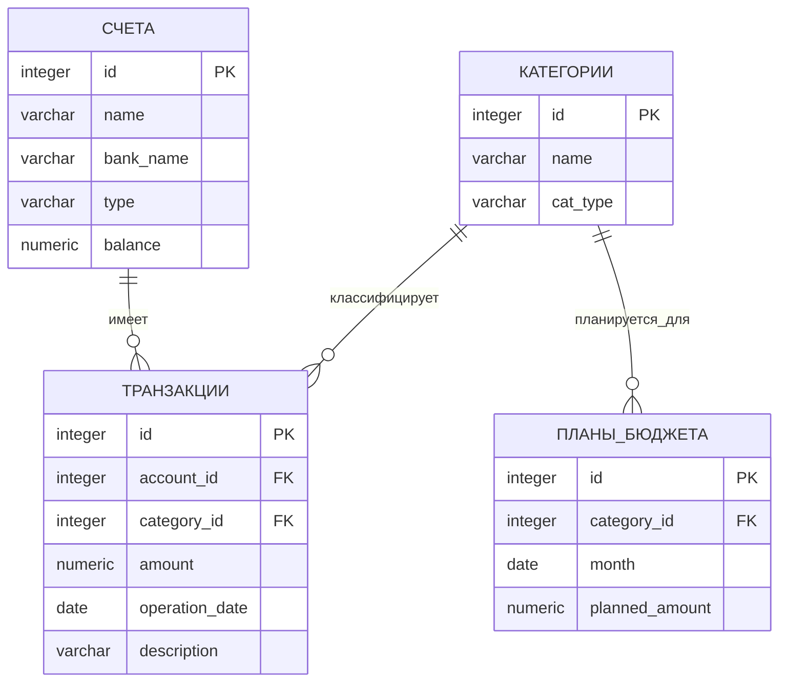

# bd
# Лабораторные работы по Базам Данных  
**Булгаков Андрей 02261-ДБ**  
**Вариант 63. Учет домашних финансов**
## 1. Постановка задачи
### Бизнес-цель
Разработать информационную систему для учета личных финансов, контроля доходов/расходов, управления счетами и планирования бюджета.

### Требования к системе
1. **Учет банковских счетов**: дебетовые, кредитные карты, наличные
2. **Категоризация операций**: разделение на доходы и расходы  
3. **Регистрация транзакций**: все финансовые операции с привязкой к счетам и категориям
4. **Планирование бюджета**: установка месячных лимитов по категориям расходов
5. **Контроль и отчетность**: мониторинг исполнения бюджета и анализ динамики баланса

### Ограничения
- Одна транзакция относится ровно к одному счету и одной категории
- План бюджета составляется только для категорий расходов
- Для одной категории может быть только один план на месяц
- Сумма транзакции всегда положительная (> 0)


## 2. ER-диаграмма


Обозначения связей:

||--o{ — отношение "один-ко-многим" (One-to-Many)

Сущность слева имеет множество связанных записей справа

## 3. Логическая модель (сущности)

Логическая модель описывает **структуру данных** без привязки к конкретной СУБД. Она определяет сущности, их атрибуты, типы данных и связи между сущностями.

### 3.1 Общая структура модели

Модель состоит из **4 основных сущностей**, связанных отношениями "один-ко-многим":

### 3.2 Детальное описание сущностей

#### **Сущность "СЧЕТА" (accounts)**
*Центральная сущность для хранения информации о финансовых инструментах.*

| Атрибут | Тип данных | Ограничения | Описание | Бизнес-логика |
|---------|------------|-------------|----------|---------------|
| **id** | SERIAL | PRIMARY KEY | Автоинкрементный идентификатор | Гарантирует уникальность каждого счета |
| **name** | VARCHAR(100) | NOT NULL | Название счета ("Основная карта") | Понятное имя для пользователя |
| **bank_name** | VARCHAR(100) | NULL | Наименование банка | Опциональная информация |
| **type** | VARCHAR(50) | NOT NULL, CHECK | Тип: 'дебетовый','кредитный','наличные' | Определяет поведение счета (кредитный может иметь отрицательный баланс) |
| **balance** | NUMERIC(15,2) | NOT NULL, DEFAULT 0.00 | Текущий баланс | Вычисляемое поле (в идеале), но для простоты хранится |

**Ключевая роль:** Каждая транзакция должна быть привязана к конкретному счету.

#### **Сущность "КАТЕГОРИИ" (categories)**
*Справочник для классификации финансовых операций.*

| Атрибут | Тип данных | Ограничения | Описание | Бизнес-логика |
|---------|------------|-------------|----------|---------------|
| **id** | SERIAL | PRIMARY KEY | Автоинкрементный идентификатор | Уникальный ID категории |
| **name** | VARCHAR(100) | NOT NULL | Название категории ("Продукты") | Группирует однотипные операции |
| **cat_type** | VARCHAR(10) | NOT NULL, CHECK | Тип: 'доход' или 'расход' | Критично для анализа (доходы увеличивают баланс, расходы уменьшают) |

**Ключевая роль:** Определяет тип операции и позволяет строить аналитику по категориям.

#### **Сущность "ТРАНЗАКЦИИ" (transactions)**
*Ядро системы, регистрирует все финансовые операции.*

| Атрибут | Тип данных | Ограничения | Описание | Бизнес-логика |
|---------|------------|-------------|----------|---------------|
| **id** | SERIAL | PRIMARY KEY | Автоинкрементный идентификатор | Уникальный ID каждой операции |
| **account_id** | INTEGER | NOT NULL, FOREIGN KEY | Ссылка на accounts(id) | Определяет, с какого счета списаны/зачислены средства |
| **category_id** | INTEGER | NOT NULL, FOREIGN KEY | Ссылка на categories(id) | Определяет тип и назначение операции |
| **amount** | NUMERIC(15,2) | NOT NULL, CHECK > 0 | Сумма операции | Всегда положительная (тип определяется категорией) |
| **operation_date** | DATE | NOT NULL, DEFAULT CURRENT_DATE | Дата операции | Для временного анализа и отчетности |
| **description** | TEXT | NULL | Описание операции | Дополнительная информация от пользователя |

**Ключевая роль:** Хранит историю всех финансовых операций. Связывает счета и категории.

#### **Сущность "ПЛАНЫ_БЮДЖЕТА" (budget_plans)**
*Планирование расходов по категориям на месяц.*

| Атрибут | Тип данных | Ограничения | Описание | Бизнес-логика |
|---------|------------|-------------|----------|---------------|
| **id** | SERIAL | PRIMARY KEY | Автоинкрементный идентификатор | Уникальный ID плана |
| **category_id** | INTEGER | NOT NULL, FOREIGN KEY | Ссылка на categories(id) | Только для категорий типа 'расход' |
| **month** | DATE | NOT NULL | Месяц планирования (01 число) | Хранится как первое число месяца |
| **planned_amount** | NUMERIC(15,2) | NOT NULL, CHECK >= 0 | Плановая сумма | Лимит расходов на месяц |

**Ключевая роль:** Позволяет контролировать расходы через сравнение плана с фактом.

### 3.3 Связи между сущностями

1. **СЧЕТА → ТРАНЗАКЦИИ** (1:N)
   - **Тип:** Один-ко-многим
   - **Описание:** Один счет может иметь множество транзакций
   - **Целостность:** ON DELETE CASCADE - при удалении счета удаляются все его транзакции

2. **КАТЕГОРИИ → ТРАНЗАКЦИИ** (1:N)  
   - **Тип:** Один-ко-многим
   - **Описание:** Одна категория может использоваться во многих транзакциях
   - **Целостность:** Стандартная ссылочная целостность

3. **КАТЕГОРИИ → ПЛАНЫ_БЮДЖЕТА** (1:N)
   - **Тип:** Один-ко-многим
   - **Описание:** Для одной категории можно составить несколько планов на разные месяцы
   - **Ограничение:** UNIQUE(category_id, month) - один план на категорию в месяц

### 3.4 Бизнес-правила, реализованные в модели

| Правило | Реализация | Назначение |
|---------|------------|------------|
| Транзакция всегда к одному счету | FOREIGN KEY account_id → accounts(id) | Гарантирует отслеживание движения средств |
| Транзакция всегда к одной категории | FOREIGN KEY category_id → categories(id) | Обеспечивает категоризацию операций |
| Тип операции определяется категорией | cat_type IN ('доход','расход') | Разделяет операции на доходы и расходы |
| План только для расходов | Неявное правило (cat_type = 'расход') | Бюджет планируется только для трат |
| Один план на категорию в месяц | UNIQUE(category_id, month) | Исключает дублирование планов |
| Сумма транзакции положительна | CHECK (amount > 0) | Упрощает вычисления (тип определяется категорией) |

### 3.5 Назначение каждой сущности в системе

| Сущность | Роль в системе | Аналог в реальном мире | Пример использования |
|----------|----------------|------------------------|----------------------|
| **СЧЕТА** | Хранилище средств | Банковские счета, кошельки | "Моя карта Тинькофф", "Наличные" |
| **КАТЕГОРИИ** | Классификатор | Статьи бюджета | "Продукты", "Транспорт", "Зарплата" |
| **ТРАНЗАКЦИИ** | Регистратор операций | Банковская выписка | "Покупка в магазине 500 руб." |
| **ПЛАНЫ_БЮДЖЕТА** | Планировщик | Бюджетный план | "На продукты в мае 30000 руб." |


## 4. Физическая модель (DDL для PostgreSQL)

```sql
-- Таблица СЧЕТА
CREATE TABLE accounts (
    id SERIAL PRIMARY KEY,
    name VARCHAR(100) NOT NULL,
    bank_name VARCHAR(100),
    type VARCHAR(50) NOT NULL CHECK (type IN ('дебетовый', 'кредитный', 'наличные')),
    balance NUMERIC(15,2) NOT NULL DEFAULT 0.00
);

-- Таблица КАТЕГОРИИ
CREATE TABLE categories (
    id SERIAL PRIMARY KEY,
    name VARCHAR(100) NOT NULL,
    cat_type VARCHAR(10) NOT NULL CHECK (cat_type IN ('доход', 'расход'))
);

-- Таблица ТРАНЗАКЦИИ
CREATE TABLE transactions (
    id SERIAL PRIMARY KEY,
    account_id INTEGER NOT NULL REFERENCES accounts(id) ON DELETE CASCADE,
    category_id INTEGER NOT NULL REFERENCES categories(id),
    amount NUMERIC(15,2) NOT NULL CHECK (amount > 0),
    operation_date DATE NOT NULL DEFAULT CURRENT_DATE,
    description TEXT
);

-- Таблица ПЛАНЫ_БЮДЖЕТА
CREATE TABLE budget_plans (
    id SERIAL PRIMARY KEY,
    category_id INTEGER NOT NULL REFERENCES categories(id),
    month DATE NOT NULL,
    planned_amount NUMERIC(15,2) NOT NULL CHECK (planned_amount >= 0),
    UNIQUE(category_id, month)
);
```

Описание физической модели:
1. Таблицы и их назначение:

accounts — хранит информацию о всех счетах пользователя

categories — справочник категорий для классификации операций

transactions — регистрирует все финансовые операции (ядро системы)

budget_plans — содержит плановые лимиты расходов по категориям

2. Типы данных:

SERIAL — автоинкрементный целочисленный тип для первичных ключей

INTEGER — для внешних ключей и целочисленных значений

VARCHAR(n) — для текстовых полей ограниченной длины

NUMERIC(15,2) — для точного хранения денежных сумм (15 цифр всего, 2 после запятой)

DATE — для хранения дат

TEXT — для неограниченных текстовых описаний

3. Ограничения целостности:

PRIMARY KEY — гарантирует уникальность записей в таблице

FOREIGN KEY — обеспечивает ссылочную целостность между таблицами

NOT NULL — поле обязательно для заполнения

CHECK — проверяет значения по заданному условию

UNIQUE — гарантирует уникальность комбинации полей

DEFAULT — задает значение по умолчанию при вставке новой записи

4. Индексы:

Оптимизируют выполнение частых запросов

Ускоряют поиск и сортировку

Улучшают производительность при работе с большими объемами данных


## Заключение
База данных для системы "Учет домашних финансов" спроектирована в соответствии с требованиями

